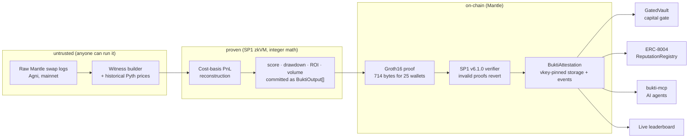

# Bukti

**Verifiable, on-chain, risk-adjusted trading track records — proven in a zkVM, on Mantle.**

**The ZK Validation layer for ERC-8004 on Mantle — the provably-fair referee for Human-vs-AI trading.**

> Nansen tells you a wallet's PnL. **Bukti proves its Sharpe ratio on-chain.** It reconstructs a wallet/agent's risk-adjusted performance (Sharpe, max drawdown, ROI, volume) from raw Mantle DeFi trades *inside an SP1 zero-knowledge VM*, then verifies the proof on Mantle and stores a tamper-proof, composable attestation — so any vault, lender, or copy-trading protocol can route capital by **proven** track record, not self-reported screenshots.

**Live demo:** https://bukti-smoky.vercel.app

> 🏆 **Flagship result — the Provable ClawHack Leaderboard.** This hackathon's Phase 1
> ("ClawHack") ranked hundreds of AI trading agents with a leaderboard you had to trust.
> Bukti re-ran that cohort *provably*: 382 wallets discovered in the Apr 15–30 window,
> the top **105 scored from 1,818 raw mainnet swap legs inside the SP1 zkVM**, and the entire
> ranking attested on-chain with **ONE 714-byte Groth16 proof**
> ([tx `0xe478d52a…`](https://sepolia.mantlescan.xyz/tx/0xe478d52a6c5e312bf0a62b4dad0f944b784da3011649947770c96e00fb82dbc6)).
> Marginal cost per extra wallet in the proof: effectively zero.

Built for **The Turing Test Hackathon 2026** (Mantle). See [PITCH.md](PITCH.md) · [SUBMISSION.md](SUBMISSION.md) · [docs/ROADMAP.md](docs/ROADMAP.md). Primary track: **AI Alpha & Data**; cross-nominated for **AI DevTools** and **Grand Champion**.

---

## The problem

Every "AI trading agent" claims a Sharpe ratio. None can *prove* it. Off-chain dashboards (Nansen, Dune, PolyVision) compute wallet PnL but the numbers are trust-me. On-chain "reputation" systems make the agent self-report. There is no permissionless, trustless way to compute a *standardized risk-adjusted* track record from raw chain data and expose it as a primitive other contracts can gate on.

Bukti is that primitive.

## How it works

```
[Indexer]  raw Mantle swap logs (Agni)  +  Pyth Benchmarks historical prices
   │        → RAW swap legs per wallet (token, amount, trade-time price)  →  batch.json
   ▼
[SP1 zkVM guest]  cost-basis PnL reconstruction for N wallets  →  realized trades
   │              → score / maxDrawdown / ROI / volume   (pure integer math)
   │              commit public values: BuktiOutput[]  (one entry per wallet)
   ▼
[Groth16 proof]  →  714 bytes, attests the WHOLE leaderboard
   ▼
[Mantle]  real SP1 verifier → BuktiAttestation.submitBatchAttestation()
          → composable, tamper-proof scores  →  GatedVault · ERC-8004 · MCP · leaderboard
```



- **The zk proof covers the reconstruction itself, not just summary stats:** the
  weighted-average cost-basis realized-PnL computation *and* the risk metrics run inside
  the zkVM in deterministic integer arithmetic.
- **The score** is a per-trade Sharpe-style information ratio (mean/std of per-trade
  returns, ×1000 on-chain) — deliberately *not* marketed as an annualized Sharpe ratio.
- **Data provenance** is anchored to a Mantle block hash, asserted by the submitting
  relayer in the MVP. In-circuit receipt-Merkle-proof verification and an on-chain
  block-hash accumulator (for fully trustless, provably-complete history) are the
  explicit roadmap — not claimed today.

## Live on Mantle Sepolia (chainId 5003) — all source-verified

| Contract | Address |
|---|---|
| **BuktiAttestation** (batch) | [`0x2EB832F24136c24A3B38D4b06D3318C48B618163`](https://sepolia.mantlescan.xyz/address/0x2EB832F24136c24A3B38D4b06D3318C48B618163) |
| **SP1 Groth16 Verifier v6.1.0** (real) | [`0xb5c7a7761221931ee15c8C70DdF4192a94C49a5A`](https://sepolia.mantlescan.xyz/address/0xb5c7a7761221931ee15c8C70DdF4192a94C49a5A) |
| GatedVault (capital gate) | [`0x851C251411Fe4F4bab586F775c7450f86A348EAD`](https://sepolia.mantlescan.xyz/address/0x851C251411Fe4F4bab586F775c7450f86A348EAD) |

The **105-agent ClawHack leaderboard** was attested with **one real Groth16 proof** verified
by the SP1 v6.1.0 verifier — junk proofs revert `WrongVerifierSelector`
([batch tx `0xe478d52a…`](https://sepolia.mantlescan.xyz/tx/0xe478d52a6c5e312bf0a62b4dad0f944b784da3011649947770c96e00fb82dbc6)).
Several scored wallets *lost* money (negative scores stored faithfully) — the point is the
ranking is reconstructed and provable, not flattering. The proof was generated locally for
**$0** on an 8 GB machine.

**ERC-8004 integration, live:** scores are also written into Mantle's canonical ERC-8004
registries on Sepolia — agent **#137** in the [IdentityRegistry](https://sepolia.mantlescan.xyz/address/0x8004A818BFB912233c491871b3d84c89A494BD9e)
with `giveFeedback` in the [ReputationRegistry](https://sepolia.mantlescan.xyz/address/0x8004B663056A597Dffe9eCcC1965A193B7388713)
([tx `0xf44b6d62…`](https://sepolia.mantlescan.xyz/tx/0xf44b6d62e80ab8e6e8f09b7da31f1975b3ea58269d66beb7fb1d3c44480464f7)).
Mantle's ERC-8004 announcement calls for "ZK-based" validation and "portable track
records" — Bukti is that layer, running. See [DEPLOYMENTS.md](DEPLOYMENTS.md).

> Earlier single-attestation v1 deployment (`0x7b0A5E9D…`, real-proof tx `0x9e224886…`) is
> documented in DEPLOYMENTS.md and superseded by the batch contract above.

## For AI agents: bukti-mcp

Agents managing capital should check **proof, not promises**. The repo ships an MCP
server ([docs/MCP.md](docs/MCP.md)) exposing 5 tools — `bukti_get_verified_score`,
`bukti_leaderboard`, `bukti_check_vault_eligibility`, `bukti_compare_wallets`,
`bukti_proof_info` — all reading live from Mantle. A real exchange:

> *"Should I copy the most active ClawHack wallet (214 swaps)?"* → agent checks Bukti →
> **"No: its zk-proven score is −0.112, below the 0.5 capital gate. The proven top
> performer is `0x48f1…` (score 4.265), already vault-approved on-chain."**

For protocol developers: [docs/INTEGRATION.md](docs/INTEGRATION.md) — gate capital by
proof in 3 lines of Solidity.

## Repository layout

```
bukti/
  lib/        Rust — shared types + compute_metrics (Sharpe/drawdown/ROI/volume)
  program/    Rust — the SP1 zkVM guest (reads trades, commits ABI-encoded metrics)
  script/     Rust — host: execute / prove / evm (Groth16 fixture) / vkey
  contracts/  Foundry — BuktiAttestation.sol, GatedVault.sol, Deploy.s.sol
  indexer/    TypeScript — reconstruct trade series from raw Mantle swaps (+ Pyth)
  web/        Next.js — address → verified score card + on-chain links
```

## Quick start

Requires a Linux environment (SP1 needs Linux/WSL2). Toolchain: Rust, [SP1](https://docs.succinct.xyz/) (`sp1up`), [Foundry](https://getfoundry.sh/), Node ≥ 20.

```bash
# 1. zkVM — reconstruct & check metrics inside the circuit
cargo run --release --bin bukti -- --execute                       # built-in sample
cargo run --release --bin bukti -- --execute --input swaps.json   # real data

# 2. Indexer — build swaps.json from real Mantle swaps (no API key)
cd indexer && npm install
npm run discover                                                         # find active wallets
npm run index -- --wallet 0x<AGENT> --from <BLOCK> --out ../swaps.json

# 3. Contracts — test & deploy
cd contracts && forge test
forge script script/Deploy.s.sol:Deploy --rpc-url $MANTLE_SEPOLIA_RPC \
  --private-key $PRIVATE_KEY --broadcast --legacy

# 4. Frontend
cd web && npm install && npm run dev
```

Copy `.env.example` → `.env` and fill `PRIVATE_KEY`, `BUKTI_VKEY` (`cargo run --bin vkey`).

## What we use on Mantle (track answers)

- **Data sources:** raw Mantle on-chain swap logs from **Agni Finance** (a PancakeSwap-V3 fork — note its non-standard Swap event) and Merchant Moe, priced via **Pyth** (MNT/USD, ETH/USD feeds). No centralized API.
- **Role of AI/zk:** the risk-adjusted metric reconstruction runs in the SP1 zkVM; the proof is the trust anchor — an AI/compute result written *verifiably* on-chain.
- **Mantle realization:** an `ISP1Verifier` on Mantle verifies the proof; `BuktiAttestation` stores the composable score; `GatedVault` demonstrates a consumer gating capital by verified Sharpe.

## Business model & go-to-market

Bukti is **trust infrastructure that gets paid when capital moves**:

- **Who pays:** protocols that route capital on reputation — copy-trading platforms, agent-vault
  curators, on-chain credit/underwriting, and funds doing due diligence on AI trading agents.
  They pay per verified attestation (proving cost + margin) or via subscription for continuous
  re-scoring of a roster of agents/wallets.
- **Why they pay:** today they either trust self-reported numbers (adverse selection) or build
  bespoke analytics (expensive, unverifiable to *their* users). A Bukti attestation is a
  number they can put in a `require()` — and show their own users as proof, not promise.
- **Wedge market:** the AI-agent economy on Mantle. Hundreds of trading agents (ClawHack alone)
  with zero verifiable track records; every agent marketplace and vault needs exactly this gate.
  ERC-8004 gives the distribution rail: Bukti writes the score, the registry carries it.
- **Post-hackathon path:** (1) real Groth16 verifier on mainnet; (2) integrate with one
  copy-trading/vault partner on Mantle as the reference consumer; (3) per-attestation fee in MNT;
  (4) expand reconstruction coverage (Merchant Moe LB, perps) as volume justifies.
- **For investors (Mirana lens):** this is a *pick-and-shovel* position on the agent economy —
  it monetizes every agent's need to prove itself, regardless of which agents win.

## Don't trust us — check

| Claim | Verify it yourself |
|---|---|
| 25 wallets attested by ONE real Groth16 proof (2.63M gas total ≈ 105k/wallet) | [batch tx `0xe478d52a…`](https://sepolia.mantlescan.xyz/tx/0xe478d52a6c5e312bf0a62b4dad0f944b784da3011649947770c96e00fb82dbc6) |
| The verifier rejects invalid proofs | submit any junk proof → revert `WrongVerifierSelector` ([verifier source](https://sepolia.mantlescan.xyz/address/0xb5c7a7761221931ee15c8C70DdF4192a94C49a5A#code)) |
| Any score, from your terminal | `cast call 0x2EB832F24136c24A3B38D4b06D3318C48B618163 "getSharpeMilli(address)(int64,bool)" <wallet> --rpc-url https://rpc.sepolia.mantle.xyz` |
| The exact bytes the zkVM committed decode in Solidity | [pinned cross-language test](contracts/test/BuktiAttestation.t.sol) (`test_zkvmBatchEncodingDecodesExactly`) |

## Trust boundary (stated openly)

The zk proof makes the **computation** (raw swap legs → cost-basis PnL → risk metrics) verifiable and deterministic. What it does **not** yet prove: that the supplied swap legs are authentic, complete, and correctly priced — the anchor block hash is relayer-asserted in the MVP. The roadmap closes this in order: (1) in-circuit receipt-Merkle-proof verification against the anchor's `receiptsRoot` (authenticity), (2) Pyth signed-price verification in-circuit (pricing), (3) an on-chain historical-block-hash accumulator + canonical full-history window policy (completeness, anti-cherry-picking). Known open limitations shared by all on-chain performance metrics: wash-trading can inflate volume, and in-window round-trips only are scored.

## Roadmap

- ~~Real SP1 Groth16 verifier on Mantle~~ ✅ done — real v6.1.0 verifier live, real proof verified on-chain.
- In-zkVM receipt-Merkle-proof verification for permissionless, no-cooperation reconstruction.
- On-chain block-hash accumulator for fully trustless historical input.
- Merchant Moe Liquidity Book (bin) accounting; LP-position PnL; multi-DEX at scale.

## License

MIT.
